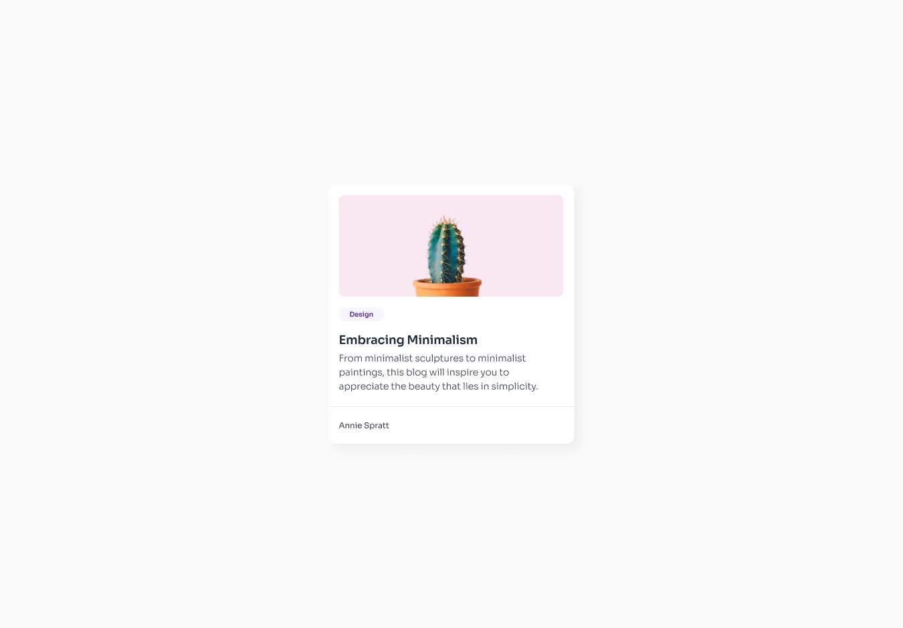
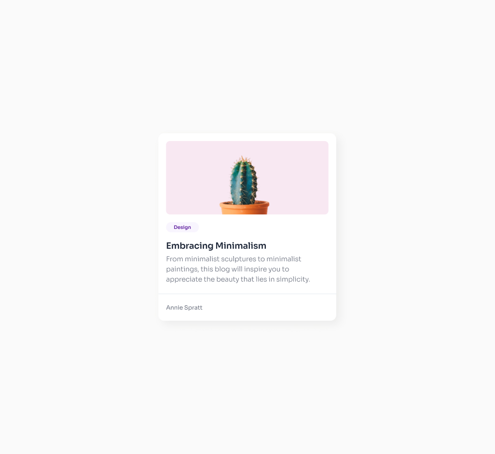

# Minimal Blog Card Challenge | devChallenges.io

## 📋 Overview
This project is a pixel-perfect implementation of the Minimal Blog Card design using semantic HTML5 and modern CSS3. The goal was to accurately replicate the provided design, ensuring responsiveness, accessibility, and clean code structure. All assets are included in the `/resources` folder.

| Desktop | Tablet | Mobile |
| ------- | ------ | ------ |
|  |  |  |

## 🚀 Features
- Fully responsive layout for desktop, tablet, and mobile
- Semantic, accessible, and maintainable HTML markup
- Custom card component with image, tag, title, description, and author
- Clean, modern CSS with attention to detail
- No external frameworks or libraries

---

## 🛠️ Built With
- HTML5
- CSS3 (vanilla, no frameworks)

---

## 📂 Getting Started

To view or use this project locally:

1. **Clone or download** this repository.
2. Open `index.html` in your preferred web browser.
3. All images and icons are located in the `/resources` folder.

---

## 📱 Responsive Design
The card layout is fully responsive and adapts seamlessly to various screen sizes. To test responsiveness, simply resize your browser window or view the project on different devices.

---

## 💡 Reflections & Learnings
This project provided an excellent opportunity to practice:
- Translating a static design into semantic HTML and CSS
- Managing spacing, typography, and color for visual consistency
- Building a component that is both visually appealing and accessible
- Ensuring cross-device compatibility and responsiveness
